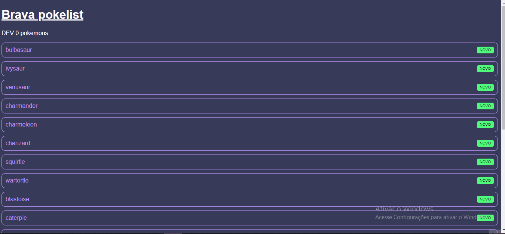

# pokemon-api-consumer

Projeto que consome uma API pokedex, para mostrar os pokemons ao clicar e também suas habilidades.😜

[]

## Tecnologias utilizadas
- HTML
-CSS
-Javascript
-React
-Context API